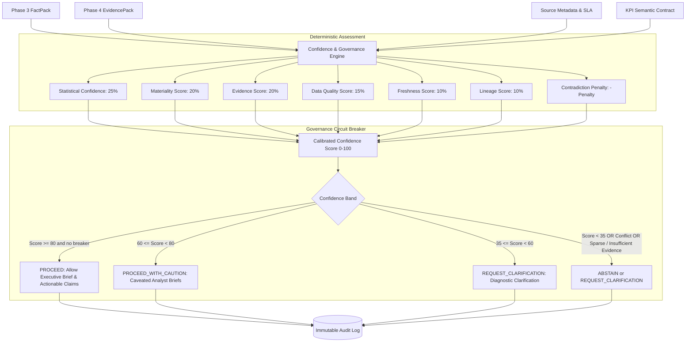

# Phase 5 — Deterministic Confidence, Governance & Abstention Engine

> [!IMPORTANT]
> **Phase 5 is fully deterministic and does not use an LLM.**
> All confidence score calibrations, driver assessments, circuit breakers, action permissions, and audit logs operate strictly using mathematical formulations, statistical thresholds, and rule-based governance policies. A future Phase 6 LLM **cannot override** `GovernanceDecision` allowed/blocked actions.

---

## 1. Architectural Overview

The **Confidence & Governance Engine** sits between the upstream analytical/retrieval layers (Phase 3 `FactPack`, Phase 4 `EvidencePack`, Source Metadata, and KPI Semantic Contracts) and any downstream synthesis personas. It acts as an authoritative circuit breaker:

Integration point: `GovernanceService.assess_kpi()` → `investigate_kpi` → `generate_fact_pack` → `get_evidence_for_factpack` → `ConfidenceEvaluator.assess_confidence` → `GovernanceCircuitBreaker.arbitrate`.

The engine **never** reads `scenarios.yaml` `ground_truth`.

---

## 2. Deterministic Confidence Formula & Weights

Formula version: **`1.1.0`**. Policy version: **`1.1.0`**.

The overall calibrated confidence score $C \in [0.0, 100.0]$ is a weighted linear combination of six normalized components minus a contradiction penalty:

$$C = \max\left(0.0, \min\left(100.0, \; \sum_{i} w_i \cdot S_i - P_{\text{contradiction}}\right)\right)$$

Weights are configured on `ConfidenceWeights` (must sum to 1.00) rather than scattered literals:

| Component ($S_i$) | Weight ($w_i$) | Source |
| :--- | :---: | :--- |
| **Statistical Confidence** | **0.25** | Phase 3 `z_score`, `p_value_approx`, baseline length |
| **Materiality Score** | **0.20** | Phase 3 dual-gate `overall_materiality` vs KPI contract threshold |
| **Evidence Score** | **0.20** | Phase 4 EvidencePack quality-weighted scores (not raw count) |
| **Data Quality Score** | **0.15** | Source catalog `data_quality_score` + completeness checks |
| **Freshness Score** | **0.10** | Source `last_refresh` vs SLA relative to anomaly window |
| **Lineage Score** | **0.10** | KPI contract upstream sources + evidence `pii_masked` lineage |

---

## 3. Component Formulations

### A. Statistical Confidence ($S_{\text{stats}}$)

Uses Phase 3 outputs only (no KPI recomputation).

- If `statistical_significance == INSUFFICIENT_HISTORY` or baseline window length `< 15` days (`GovernanceThresholds.minimum_baseline_days`):
  $$S_{\text{stats}} = 25.0$$
- If $|z| \ge 3.0$ or $p \le 0.005$: $S_{\text{stats}} = 95.0$
- If $|z| \ge 2.0$ or $p \le 0.05$: $S_{\text{stats}} = 80.0$
- If $1.0 \le |z| < 2.0$: $S_{\text{stats}} = 55.0$
- If $|z| < 1.0$: $S_{\text{stats}} = 30.0$

### B. Business Materiality vs. Statistical Significance

Phase 3 already separates gates (`STATISTICALLY_SIGNIFICANT` vs `MATERIAL`). Governance maps `overall_materiality`:

- **`CRITICAL_ACTIONABLE`**: $S_{\text{mat}} = 100.0$ (business threshold **and** statistical gate)
- **`BUSINESS_WARNING`**: $S_{\text{mat}} = 80.0$ (material business delta, weak stats)
- **`STATISTICAL_NOISE`**: $S_{\text{mat}} = 35.0$ (significant z, below contract `%` threshold — not business-critical)
- **`NORMAL`**: $S_{\text{mat}} = 20.0`
- **`INSUFFICIENT_HISTORY`**: $S_{\text{mat}} = 25.0`

A tiny but statistically significant movement therefore cannot be treated as executive-critical.

### C. Evidence Scoring ($S_{\text{evid}}$)

- If `EvidencePack.status == "INSUFFICIENT_EVIDENCE"` or zero supporting items: $S_{\text{evid}} = 0.0$
- Otherwise score is the **top-3 mean** of supporting item `score` values (exact-window items preferred). Ten weak documents cannot outrank one high-scoring temporally aligned incident.
- Exact-window + top-3 mean $\ge 80$: $S_{\text{evid}} = \min(100, \text{top-3 mean})$

### D. Data Quality ($S_{\text{dq}}$)

Mean of catalog `data_quality_score` values scaled to $[0, 100]$ (sales 0.98, marketing 0.95, ops 0.92). Penalties for sparse history, NaN anomaly scores, and missing contract dimensional drilldowns.

### E. Freshness ($S_{\text{fresh}}$)

For each source, `last_refresh` is compared to the investigation **anomaly window end** (not wall-clock, so demo snapshots remain coherent):

- Refresh on/after window end, or age within `freshness_sla_minutes`: 100
- Age $\le 2\times$ SLA: 55 + warning
- Else: 25 + warning

Evidence older than the anomaly window is already excluded from Phase 4 packs (`OUTSIDE_WINDOW` filtered) and is not treated as direct corroboration.

### F. Lineage ($S_{\text{lineage}}$)

Starts at 100. Reduced if the KPI contract has no upstream sources or retrieved evidence lacks `lineage.pii_masked == true`.

### G. Contradiction Penalty ($P_{\text{contradiction}}$)

$$\text{Ratio} = \frac{N_{\text{contradictory}}}{N_{\text{supporting}} + N_{\text{contradictory}}}$$

Configurable threshold: `contradiction_ratio_threshold = 0.35`.

- Supporting 0 and contradictory $> 0$: $P = 45.0$
- Ratio $\ge 0.35$: $P = \min(50.0, \text{Ratio} \times 70.0)$
- Ratio $< 0.35$: $P = \min(25.0, \text{Ratio} \times 40.0)$

Every material contradiction records `conflict_summary` (conflicting issue types) and `conflicting_evidence_ids`.

---

## 4. Governance Bands & Action Permissions

| Confidence Band | Range | Decision | Allowed Downstream Actions | Blocked Downstream Actions |
| :--- | :---: | :--- | :--- | :--- |
| **`HIGH`** | $[80.0, 100.0]$ | **`PROCEED`** | `GENERATE_EXECUTIVE_BRIEF`, `GENERATE_ANALYST_DEEPDIVE`, `SYNTHESIZE_EXPLANATION`, `RECOMMEND_ACTION`, `DRILL_DOWN_DIMENSIONS`, `AUTOMATE_ALERTING` | None |
| **`MEDIUM`** | $[60.0, 80.0)$ | **`PROCEED_WITH_CAUTION`** | `GENERATE_CAVEATED_ANALYST_BRIEF`, `SYNTHESIZE_HYPOTHESIS`, `DRILL_DOWN_DIMENSIONS`, `REQUEST_SUPPLEMENTAL_VERIFICATION` | `RECOMMEND_HIGH_IMPACT_ACTION`, `AUTOMATE_EXECUTION`, `GENERATE_UNCAVEATED_EXECUTIVE_CLAIM` |
| **`LOW`** | $[35.0, 60.0)$ | **`REQUEST_CLARIFICATION`** | `GENERATE_CLARIFICATION_PROMPT`, `REQUEST_OPERATIONAL_INVESTIGATION`, `REQUEST_ADDITIONAL_DATA`, `DISPLAY_DIAGNOSTIC_DRILLDOWN` | `GENERATE_EXECUTIVE_CLAIM`, `RECOMMEND_ACTION`, `SYNTHESIZE_EXPLANATION`, `AUTOMATE_EXECUTION` |
| **`ABSTAIN`** | $[0.0, 35.0)$ | **`ABSTAIN`** | `GENERATE_ABSTENTION_NOTICE`, `FLAG_DATA_QUALITY_ALERT`, `REQUEST_MANUAL_REVIEW`, `REQUEST_ADDITIONAL_DATA`, `DISPLAY_RAW_METRICS` | `GENERATE_EXECUTIVE_CLAIM`, `GENERATE_EXECUTIVE_BRIEF`, `RECOMMEND_ACTION`, `SYNTHESIZE_EXPLANATION`, `AUTOMATE_EXECUTION` |

---

## 5. Explicit Circuit Breakers & Abstention Rules

These fire **before** (or instead of) band-from-score mapping:

1. **Severe Contradiction** ($P \ge 35.0$): **`ABSTAIN`**, reason `CONTRADICTORY_EVIDENCE`. Explains conflicting issue types and why one explanation cannot be chosen.
2. **Sparse History** (insufficient Phase 3 history or baseline $< 15$ days, e.g. Scenario 4): **`REQUEST_CLARIFICATION`**, reason `SPARSE_HISTORY`. Statistical component forced to 25.
3. **Insufficient Evidence** (`INSUFFICIENT_EVIDENCE` or $S_{\text{evid}} = 0$): **`REQUEST_CLARIFICATION`**, never `HIGH` / `PROCEED`. Reasons include *"No sufficient evidence was found..."*. No evidence is manufactured.

---

## 6. Deterministic Clarification Generation

Questions are assembled from reason codes (no LLM):

- Contradictory freight vs discount (Scenario 5 pattern)
- Sparse / cold-start baseline
- Missing corroborating tickets in the anomaly window (optional EU gateway window prompt)
- Stale pipeline vs last snapshot

---

## 7. Role-Based Access Control (RBAC) Interaction

Phase 4 retrieval is invoked with `user_role`; Chroma filtering is unchanged. Governance endpoints **do not return evidence snippets**.

- **`EXECUTIVE`**: KPI scores, bands, decisions, high-level driver bands. No `conflicting_evidence_ids`, no PII.
- **`ANALYST`**: Full driver justifications, lineage notes, statistical reasons.
- **`OPERATIONS`**: Operational/signal driver assessments when present.

---

## 8. Immutable Audit Trail

Every evaluation appends an `AuditRecord`:

- `assessment_id`, `timestamp`, `kpi_id`, `scenario_id`, `user_role`
- `input_factpack_hash`, `input_evidencepack_hash`
- `formula_version`, `policy_version`
- `overall_confidence`, `confidence_band`, `decision`, `reason_codes`
- `clarification_count`, `assessment_latency_ms`

`audit_metadata.llm_override_allowed` is always `false`.

---

## 9. REST API Endpoints

| Method | Endpoint | Query / Path Parameters | Response Description |
| :--- | :--- | :--- | :--- |
| `GET` | `/api/governance/assess/{kpi_id}` | `scenario_id`, `role`, `top_k` | `ConfidenceAssessment` & `GovernanceDecision` (no evidence body) |
| `GET` | `/api/governance/status` | None | Policy, formula weights, thresholds, latest assessments |
| `GET` | `/api/governance/assessments` | `limit` | Historical audit records |

---

## 10. Limitations

- Freshness is evaluated against the **investigation anomaly window**, not live wall-clock, because catalog `last_refresh` is a static demo snapshot.
- Revenue multiplicative decomposition is richest for `kpi_revenue`; other KPIs have thinner `ranked_drivers` and therefore thinner per-driver assessments.
- Evidence retrieval still uses Phase 4 driver-name matching; display-name drivers are aliased in governance scoring only.
- Contradiction classification of freight memos in Scenario 5 is performed in Phase 4; Phase 5 consumes the resulting pack.
- Data-quality NaN/missing-dimension checks are conservative; they do not replace a full warehouse profiler.

---

## 11. Demonstration Mapping

| Scenario | Expected governance posture |
| :--- | :--- |
| `SCENARIO_1_MULTI_FACTOR` | Material revenue decline, high stats, strong evidence → `PROCEED` or `PROCEED_WITH_CAUTION` |
| `SCENARIO_2_HIGH_CONFIDENCE` | Single-factor campaign outage → high/caution proceed |
| `SCENARIO_3_LOW_CONFIDENCE` | Weak AOV, little evidence → clarification / abstain |
| `SCENARIO_4_SPARSE_HISTORY` | Cold start → `REQUEST_CLARIFICATION` or `ABSTAIN` |
| `SCENARIO_5_CONTRADICTORY_EVIDENCE` | Freight vs discount conflict → `ABSTAIN` or `REQUEST_CLARIFICATION` |
