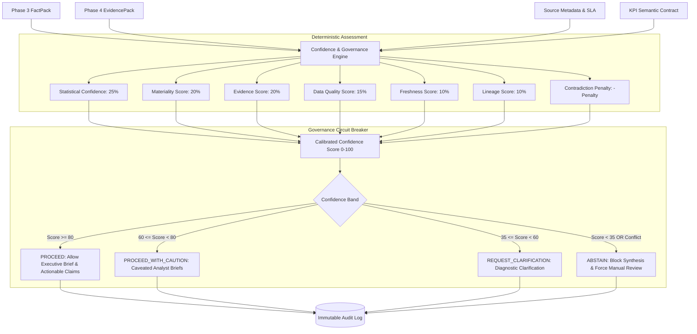

# Phase 5 — Deterministic Confidence, Governance & Abstention Engine

> [!IMPORTANT]
> **Phase 5 is fully deterministic and does not use an LLM.**
> All confidence score calibrations, driver assessments, circuit breakers, action permissions, and audit logs operate strictly deterministically using mathematical formulations, statistical thresholds, and rule-based governance policies.

---

## 1. Architectural Overview

The **Confidence & Governance Engine** sits between the upstream analytical/retrieval layers (Phase 3 `FactPack`, Phase 4 `EvidencePack`, Source Metadata, and KPI Semantic Contracts) and any downstream synthesis personas. It acts as an authoritative circuit breaker:



---

## 2. Deterministic Confidence Formula & Weights

The overall calibrated confidence score $C \in [0.0, 100.0]$ is computed using a weighted linear combination of six normalized components minus a non-linear contradiction penalty:

$$C = \max\left(0.0, \min\left(100.0, \; \sum_{i} w_i \cdot S_i - P_{\text{contradiction}}\right)\right)$$

### Component Weights ($w_i$)

| Component ($S_i$) | Weight ($w_i$) | Description |
| :--- | :---: | :--- |
| **Statistical Confidence** ($S_{\text{stats}}$) | **$0.25$** | Evaluated from baseline sample size, $z$-score separation, and $p$-value approximation. |
| **Materiality Score** ($S_{\text{mat}}$) | **$0.20$** | Business impact assessed against KPI semantic contract relative delta thresholds. |
| **Evidence Score** ($S_{\text{evid}}$) | **$0.20$** | Corroboration strength from top temporally aligned Phase 4 operational documents. |
| **Data Quality Score** ($S_{\text{dq}}$) | **$0.15$** | Ingestion completeness, null checks, and schema validity across heterogeneous tables. |
| **Freshness Score** ($S_{\text{fresh}}$) | **$0.10$** | Source refresh timestamps evaluated against configured SLA cadences (e.g. hourly, daily). |
| **Lineage Score** ($S_{\text{lineage}}$) | **$0.10$** | Verified end-to-end table lineage and PII sanitization proof. |

---

## 3. Component Formulations

### A. Statistical Confidence ($S_{\text{stats}}$)
- If historical observations $< 15$ days (e.g. Scenario 4 sparse history) or `has_sufficient_history == False`:
  $$S_{\text{stats}} = 25.0$$
- If $|z| \ge 3.0$ and $p \le 0.005$: $S_{\text{stats}} = 95.0$
- If $2.0 \le |z| < 3.0$ and $p \le 0.05$: $S_{\text{stats}} = 80.0$
- If $1.0 \le |z| < 2.0$: $S_{\text{stats}} = 55.0$
- If $|z| < 1.0$: $S_{\text{stats}} = 30.0$

### B. Business Materiality vs. Statistical Significance
The engine explicitly separates statistical distinctness from business criticality:
- **`CRITICAL_ACTIONABLE`**: $S_{\text{mat}} = 100.0$ (both statistically significant and exceeding business threshold $\Delta \ge 5\%$).
- **`BUSINESS_WARNING`**: $S_{\text{mat}} = 80.0$ (material business delta observed).
- **`STATISTICAL_NOISE`**: $S_{\text{mat}} = 35.0$ (statistically separated from baseline, but below business materiality threshold; prevents false alarms).
- **`NORMAL`**: $S_{\text{mat}} = 20.0$ (within normal operational variance).
- **`INSUFFICIENT_HISTORY`**: $S_{\text{mat}} = 25.0$.

### C. Evidence Scoring ($S_{\text{evid}}$)
- If `EvidencePack.status == "INSUFFICIENT_EVIDENCE"` or `len(supporting) == 0`:
  $$S_{\text{evid}} = 0.0$$
- If exact-window supporting items exist with average score $\ge 80.0$:
  $$S_{\text{evid}} = \min(100.0, \text{avg\_score})$$
- Quality is strictly prioritized over document count: 10 low-scoring unrelated logs cannot outscore 1 high-scoring temporally aligned incident.

### D. Contradiction Handling & Penalty ($P_{\text{contradiction}}$)
When operational evidence conflicts with quantitative driver decomposition (e.g. Scenario 5 freight carrier surcharge memos vs. sales promotional discounts):
$$\text{Ratio} = \frac{N_{\text{contradictory}}}{N_{\text{supporting}} + N_{\text{contradictory}}}$$
- If $N_{\text{supporting}} == 0$ and $N_{\text{contradictory}} > 0$: $P = 45.0$
- If $\text{Ratio} \ge 0.35$: $P = \min(50.0, \text{Ratio} \times 70.0)$
- If $\text{Ratio} < 0.35$: $P = \min(25.0, \text{Ratio} \times 40.0)$

---

## 4. Governance Bands & Action Permissions

| Confidence Band | Range | Decision | Allowed Downstream Actions | Blocked Downstream Actions |
| :--- | :---: | :--- | :--- | :--- |
| **`HIGH`** | $[80.0, 100.0]$ | **`PROCEED`** | `GENERATE_EXECUTIVE_BRIEF`, `GENERATE_ANALYST_DEEPDIVE`, `SYNTHESIZE_EXPLANATION`, `RECOMMEND_ACTION`, `DRILL_DOWN_DIMENSIONS`, `AUTOMATE_ALERTING` | None |
| **`MEDIUM`** | $[60.0, 80.0)$ | **`PROCEED_WITH_CAUTION`** | `GENERATE_CAVEATED_ANALYST_BRIEF`, `SYNTHESIZE_HYPOTHESIS`, `DRILL_DOWN_DIMENSIONS`, `REQUEST_SUPPLEMENTAL_VERIFICATION` | `RECOMMEND_HIGH_IMPACT_ACTION`, `AUTOMATE_EXECUTION`, `GENERATE_UNCAVEATED_EXECUTIVE_CLAIM` |
| **`LOW`** | $[35.0, 60.0)$ | **`REQUEST_CLARIFICATION`** | `GENERATE_CLARIFICATION_PROMPT`, `REQUEST_OPERATIONAL_INVESTIGATION`, `REQUEST_ADDITIONAL_DATA`, `DISPLAY_DIAGNOSTIC_DRILLDOWN` | `GENERATE_EXECUTIVE_CLAIM`, `RECOMMEND_ACTION`, `SYNTHESIZE_EXPLANATION`, `AUTOMATE_EXECUTION` |
| **`ABSTAIN`** | $[0.0, 35.0)$ | **`ABSTAIN`** | `GENERATE_ABSTENTION_NOTICE`, `FLAG_DATA_QUALITY_ALERT`, `REQUEST_MANUAL_REVIEW`, `DISPLAY_RAW_METRICS` | `GENERATE_EXECUTIVE_CLAIM`, `GENERATE_EXECUTIVE_BRIEF`, `RECOMMEND_ACTION`, `SYNTHESIZE_EXPLANATION`, `AUTOMATE_EXECUTION` |

---

## 5. Explicit Circuit Breakers & Abstention Rules

1. **Severe Contradiction Circuit Breaker**:
   - Triggered when $P_{\text{contradiction}} \ge 35.0$ (e.g. Scenario 5).
   - Forces decision to **`ABSTAIN`**.
   - Reason Code: `CONTRADICTORY_EVIDENCE`.
   - Generates deterministic clarification prompt explaining the conflicting domains.

2. **Sparse History Circuit Breaker**:
   - Triggered when baseline sample size $< 15$ days (e.g. Scenario 4 with 10 days).
   - Forces decision to **`REQUEST_CLARIFICATION`**.
   - Reason Code: `SPARSE_HISTORY`.

3. **Insufficient Evidence Handling**:
   - Triggered when $S_{\text{evid}} == 0.0$ during a material movement.
   - Demotes confidence band to **`LOW`** or **`MEDIUM`** and blocks definitive executive claims.

---

## 6. Deterministic Clarification Generation

Clarification questions are assembled deterministically from structured reason codes without using an LLM:

- **Contradictory Signal**:
  > *"Operational carrier memos report freight surcharges, but quantitative data indicates discount promotions drove the margin drop. Which operational domain should be prioritized for verification?"*
- **Sparse History**:
  > *"Baseline historical observations are limited to 10 days. Should the investigation compare against an annualized seasonal baseline or proceed with caveated variance bounds?"*
- **Missing Evidence**:
  > *"No customer support tickets or incident logs corroborated KPI 'kpi_conv_rate' in window 2026-08-22 to 2026-08-28. Should the query window be widened?"*
- **Stale Pipeline**:
  > *"One or more upstream data sources are delayed past SLA. Should the analysis utilize the latest cached snapshot or await pipeline refresh?"*

---

## 7. Role-Based Access Control (RBAC) Interaction

The Governance layer enforces Phase 4 security constraints:
- **`EXECUTIVE` Persona**: Receives high-level confidence scores, primary driver summaries, and policy decisions. Zero customer PII or restricted ticket snippets are exposed.
- **`ANALYST` Persona**: Receives granular driver-level confidence breakdowns, full statistical distributions, and PII-sanitized evidence references.
- **`OPERATIONS` Persona**: Receives operational incident and technical SLA metrics.

---

## 8. Immutable Audit Trail

Every confidence evaluation logs an immutable `AuditRecord`:
```json
{
  "assessment_id": "CONF-20260829-220816cf",
  "timestamp": "2026-08-29T14:45:11.575710Z",
  "kpi_id": "kpi_revenue",
  "scenario_id": "SCENARIO_1_MULTI_FACTOR",
  "user_role": "ANALYST",
  "input_factpack_hash": "a1b2c3d4e5f67890",
  "input_evidencepack_hash": "f0e1d2c3b4a56789",
  "formula_version": "1.0.0",
  "policy_version": "1.0.0",
  "overall_confidence": 96.7,
  "confidence_band": "HIGH",
  "decision": "PROCEED",
  "reason_codes": [
    "HIGH_CONFIDENCE_MULTI_FACTOR_CORROBORATION"
  ],
  "clarification_count": 0
}
```

---

## 9. REST API Endpoints

| Method | Endpoint | Query / Path Parameters | Response Description |
| :--- | :--- | :--- | :--- |
| `GET` | `/api/governance/assess/{kpi_id}` | `scenario_id`, `role`, `top_k` | `ConfidenceAssessment` & `GovernanceDecision` |
| `GET` | `/api/governance/status` | None | Active policy, formula weights, and thresholds |
| `GET` | `/api/governance/assessments` | `limit` | Historical audit records for governance review |
