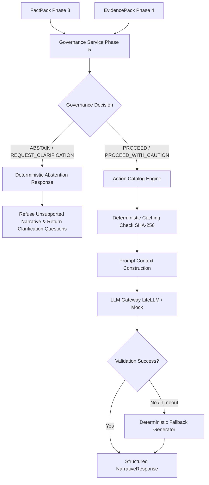

# Phase 6: Governed LLM Narrative & Action Recommendation Engine

## 1. Executive Summary & Core Principle

Verta.ai Phase 6 introduces a governed, persona-specific narrative synthesis and action recommendation layer.

> [!IMPORTANT]
> **Strict Non-LLM Quantitative Principle:**
> The LLM is a narrative synthesis layer, NOT the quantitative source of truth.
> The LLM MUST NOT calculate KPI values, driver contributions, statistical significance, confidence scores, or governance decisions.
> All quantitative facts, driver decompositions, evidence matches, confidence scores, and action catalogs are computed deterministically in Phases 1–5.

---

## 2. Architecture & Pipeline

---

## 3. Persona Differentiation

| Dimension | Executive Persona (`EXECUTIVE`) | Analyst Persona (`ANALYST`) |
| :--- | :--- | :--- |
| **Primary Audience** | C-Suite, VP of E-Commerce, Directors | Data Scientists, BI Analysts, Finance Leads |
| **Headline Style** | High-level business takeaway (< 15 words) | Technical finding with exact $|z|$-score, percentage, and dollar delta |
| **Summary Content** | High-level 2–3 sentence business impact and top drivers | Exhaustive decomposition, baseline distribution, statistical significance |
| **Driver Presentation** | Top 2–3 drivers with magnitude | Full driver ranking, multiplicative math, mix-shift breakdown |
| **Evidence Citations** | Key corroborating operational tickets | Exhaustive mapping of evidence IDs, source tables, and temporal alignments |
| **Data Quality & Lineage** | High-level confidence rating | Full source catalog scores, SLA refresh latencies, and lineage contract |
| **Caveats & Uncertainties** | Strategic business risks and confidence band | Statistical assumptions, variance limits, and residual hypotheses |

---

## 4. Approved Deterministic Action Catalog & Decision Rights

Every action recommendation is structured strictly according to the Accenture Innovation Challenge paradigm:
$$\text{driver} \longrightarrow \text{controllable lever} \longrightarrow \text{action} \longrightarrow \text{expected impact} \longrightarrow \text{owner} \longrightarrow \text{confidence} \longrightarrow \text{monitoring plan} \longrightarrow \text{decision right}$$

### Curated Action Catalog:
1. **`conversion_rate` / `PAYMENT_GATEWAY_TIMEOUT`**:
   - **Action ID**: `ACT-PAYMENT-001`
   - **Lever**: Payment Gateway Routing & Retry Infrastructure
   - **Action**: Enable secondary gateway failover and adjust HTTP timeout threshold from 2.0s to 5.0s for EU checkout sessions.
   - **Owner**: `Payments Operations`
   - **Expected Impact**: Restore checkout conversion rate to baseline (>3.2%) and recover ~$28,000 weekly revenue loss.
   - **Monitoring Plan**: Track 15-minute checkout success rates, gateway HTTP 504 error frequency, and regional drop-offs.
   - **Decision Right**: `Payments Operations`
2. **`product_availability` / `STOCKOUT`**:
   - **Action ID**: `ACT-INVENTORY-001`
   - **Lever**: Safety Stock Allocation & Regional Replenishment
   - **Action**: Execute expedited inventory transfer and increase dynamic safety stock buffers for high-velocity SKUs (Apparel).
   - **Owner**: `Inventory Operations`
   - **Expected Impact**: Eliminate stockout friction and recover ~$12,500 in weekly lost order volume.
   - **Monitoring Plan**: Monitor hourly SKU availability %, backorder queues, and add-to-cart-to-purchase completion.
   - **Decision Right**: `Inventory Operations`
3. **`marketing_spend` / `CAMPAIGN_BUDGET_REDUCTION`**:
   - **Action ID**: `ACT-MARKETING-001`
   - **Lever**: Paid Acquisition Bidding & Channel Budget Allocation
   - **Action**: Restore automated search campaign bidding allocations in underperforming regions and audit ad copy efficiency.
   - **Owner**: `Growth Marketing`
   - **Expected Impact**: Re-establish paid acquisition session volume (+15%) and lift top-of-funnel gross revenue.
   - **Monitoring Plan**: Monitor daily ROAS, CAC, target CPC bids, and paid search attributed traffic volume.
   - **Decision Right**: `Growth Marketing`
4. **`aov` / `mix_shift` / `discount_rate`**:
   - **Action ID**: `ACT-COMMERCIAL-001`
   - **Lever**: Promotional Thresholds & Bundle Merchandising
   - **Action**: Recalibrate free shipping basket thresholds from $50 to $65 and introduce cross-category accessory bundles.
   - **Owner**: `Commercial Finance`
   - **Expected Impact**: Protect gross margin by +180 bps and lift AOV towards the $85 baseline.
   - **Monitoring Plan**: Monitor daily category margin contributions, promotional discount uptake, and average basket depth.
   - **Decision Right**: `Commercial Finance`

> [!NOTE]
> If an action cannot be assigned to an approved owner from the catalog, `decision_right` is deterministically assigned to `REQUIRES_HUMAN_REVIEW`.

---

## 5. Governance Circuit Breaker & Abstention Enforcement

When Phase 5 Governance returns `ABSTAIN` or `REQUEST_CLARIFICATION`:
1. **Zero LLM Invocation**: The LLM is strictly bypassed to prevent hallucination of ungrounded causal narratives.
2. **Deterministic Explanation**: Returns exact reason codes (e.g. `CONTRADICTORY_EVIDENCE`, `SPARSE_HISTORY`).
3. **Conflict Summary**: Explains why evidence conflicts (e.g., shipping surcharge memos vs promotional discount models).
4. **Clarification Questions**: Generates actionable questions for user confirmation.
5. **Action Blocking**: All high-impact autonomous recommendations are blocked.

---

## 6. Deterministic Fallback Generator

If external LLM APIs time out, fail validation, or lack API keys, `DeterministicNarrativeGenerator` creates a complete, compliant `NarrativeResponse` directly from verified `FactPack` and `EvidencePack` fields.
- Mode is clearly marked as `generation_mode = "DETERMINISTIC_FALLBACK"`.
- Never crashes the application.

---

## 7. Telemetry, Token Accounting & Cost Estimation

Every narrative request captures execution metadata:
- `latency_ms`: Request execution time.
- `input_tokens`, `output_tokens`, `total_tokens`: Extracted from provider response.
- `estimated_cost`: Computed via `(input_tokens * input_rate + output_tokens * output_rate) / 1000`.
- `fallback_used`: Flag indicating whether deterministic fallback was triggered.
- `cache_hit`: Flag indicating whether result was served from the SHA-256 cache.

---

## 8. API Endpoints

- `POST /api/narrative/generate/{kpi_id}`: Synthesizes governed narrative for specified persona (`EXECUTIVE` or `ANALYST`).
- `GET /api/narrative/status`: Returns provider health, model name, pricing, and cache size.
- `GET /api/narrative/telemetry`: Returns recent execution logs with latencies and token economics.
- `POST /api/actions/recommend/{kpi_id}`: Dedicated action recommendation retrieval from the approved catalog.
